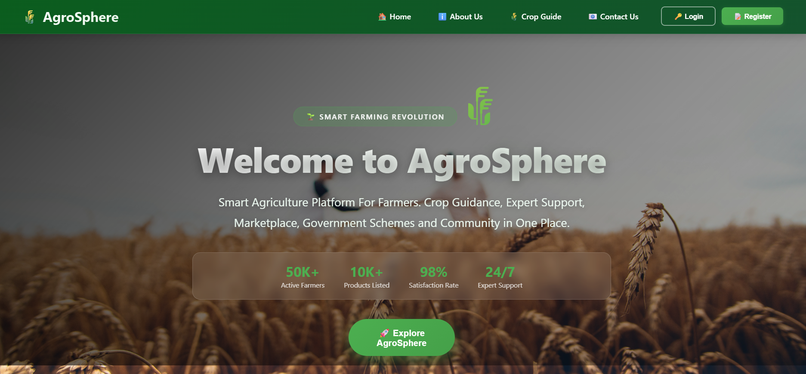
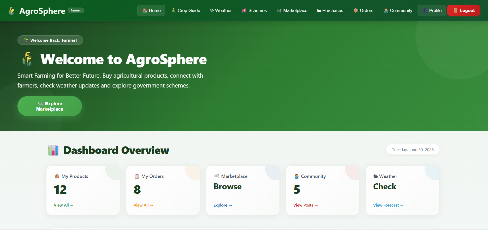
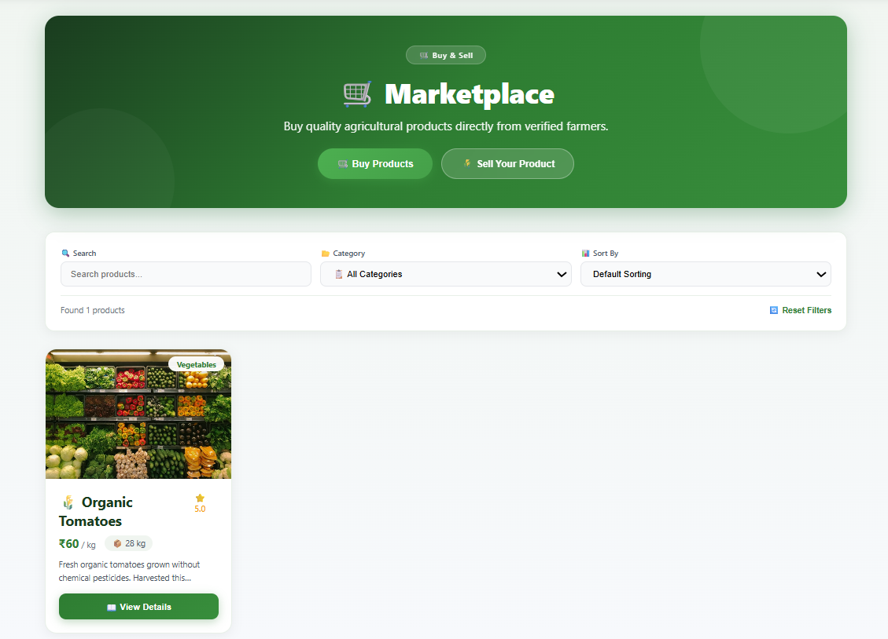
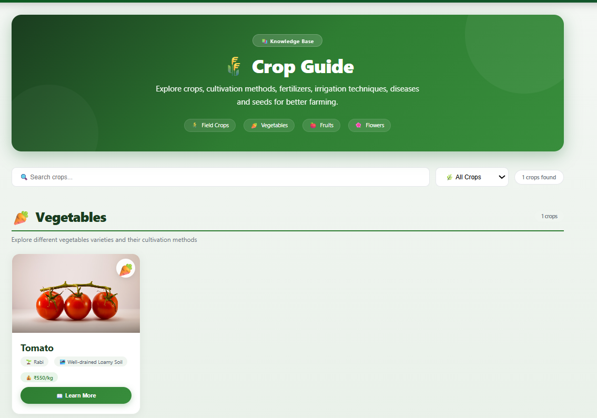
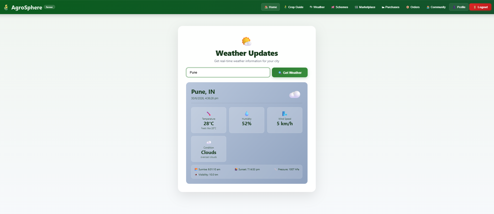
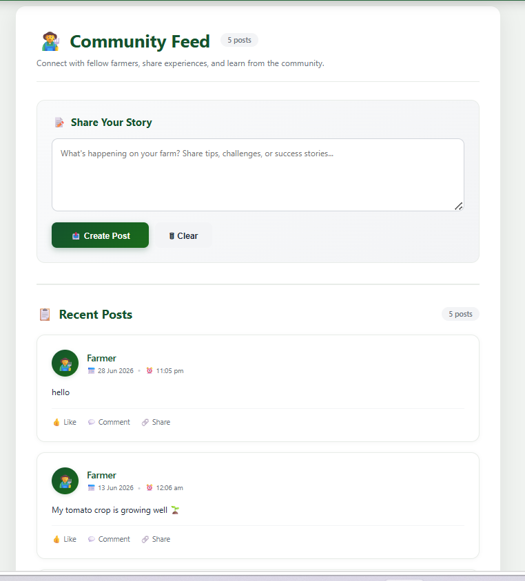
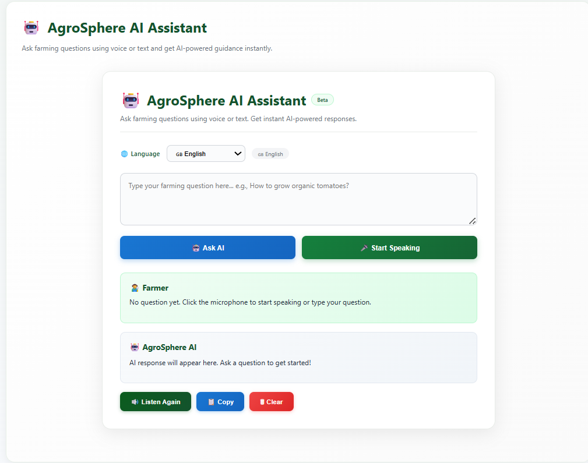
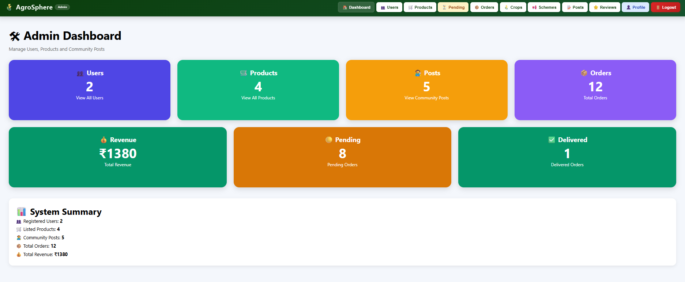

# 🌾 AgroSphere 

A modern **MERN Stack** based Smart Agriculture Marketplace Platform that connects farmers and buyers through a secure digital marketplace with AI assistance, Razorpay payments, weather updates, crop guidance, community interaction, product approval workflow, and a powerful admin dashboard.

---

# 🚀 Live Demo

### 🌐 Live Application

https://agro-sphere-egok.vercel.app

### 💻 GitHub Repository

https://github.com/Janhvi7105/AgroSphere

---

# 📖 Project Overview

AgroSphere is a full-stack MERN Stack web application developed to digitize agricultural commerce by providing a secure online marketplace where farmers can sell agricultural products directly to buyers.

The platform includes product approval workflows, secure authentication, online payments, AI-powered farming assistance, weather forecasting, crop guidance, government schemes, community interaction, order management, and an advanced administrative dashboard.

Built as a final-year project, AgroSphere demonstrates practical implementation of modern full-stack technologies with practical agricultural solutions.

---

# 💡 Why This Project?

Farmers often face challenges in reaching buyers, obtaining accurate farming guidance, accessing government schemes, and selling products efficiently.

AgroSphere addresses these challenges by providing one unified platform where farmers can:

- 🌾 Sell agricultural products
- 🤖 Receive AI farming guidance
- 🌦 Check live weather updates
- 📚 Explore crop guidance
- 🏛 Learn government schemes
- 👥 Connect with other farmers
- 📦 Manage orders securely

---

# 🌟 Project Highlights

✔ Secure JWT Authentication

✔ Razorpay Payment Integration

✔ Google Gemini AI Assistant

✔ Live Weather Updates

✔ Crop Guide & Disease Information

✔ Government Schemes Portal

✔ Product Approval Workflow

✔ Community Discussion Platform

✔ Reviews & Ratings

✔ Comprehensive Admin Dashboard

---

# ⭐ Key Features Preview

| Home | Marketplace |
|------|-------------|

| Crop Guide | Weather Updates |
|------------|-----------------|

| AI Assistant | Community |
|-------------|------------|

| Farmer Dashboard | Admin Dashboard |
|------------------|----------------|

| Orders | Product Approval |
|--------|------------------|

---

# ✨ Features

## 👨‍🌾 Farmer Module

- User Registration
- Secure Login
- JWT Authentication
- Farmer Dashboard
- Add/Edit/Delete Products
- Product Status Tracking
- My Products
- Order Management
- Profile Management

---

## 🛒 Marketplace

- Browse Approved Products
- Product Details
- Search Products
- Category Filtering
- Product Sorting
- Quantity Selection
- Stock Availability
- Purchase Products

---

## 💳 Secure Payments

Powered by Razorpay

- Secure Payment Gateway
- Payment Verification
- Instant Order Confirmation
- Protected Transactions

---

## 📦 Order Management

- Purchase History
- Order Tracking
- Delivery Address
- Payment Status
- Farmer Order Management

---

## 🌾 Smart Crop Guide

Includes:

- Crops
- Vegetables
- Fruits
- Flowers
- Soil Information
- Fertilizer Recommendations
- Disease Identification
- Treatment Suggestions
- Seed Prices
- Video Tutorials

---

## 🌦 Live Weather Updates

Powered by OpenWeather API

Features:

- City Search
- Live Temperature
- Humidity
- Wind Speed
- Weather Conditions
- Pressure
- Sunrise & Sunset

---

## 🏛 Government Schemes

Farmers can explore:

- Government Agricultural Schemes
- Eligibility
- Benefits
- Official Information
- Application Details

---

## 👥 Community Platform

- Create Posts
- Community Feed
- Farmer Discussions
- Share Farming Experiences

---

## ⭐ Product Reviews

Users can:

- Submit Ratings
- Write Reviews
- View Average Ratings
- Read Customer Feedback

---

## 🤖 AI Farming Assistant

Powered by Google Gemini AI

Supports:

- Agriculture Questions
- Crop Recommendations
- Farming Advice
- Disease Guidance
- General Farming Information
- Voice Input Support

---

## 👨‍💼 Admin Dashboard

Manage:

- Users
- Products
- Pending Product Approvals
- Orders
- Crop Guide
- Government Schemes
- Community Posts
- Reviews
- Dashboard Analytics

---

# ⚡ Key Technologies

| Category | Technology |
|----------|------------|
| Frontend | React.js |
| Backend | Node.js + Express.js |
| Database | MongoDB Atlas |
| Authentication | JWT + bcryptjs |
| Payment | Razorpay |
| AI | Google Gemini |
| Weather API | OpenWeather API |
| HTTP Client | Axios |
| Deployment | Vercel + Render |

---

# 🏗 Project Structure

```text
AgroSphere
│
├── backend
│   ├── config
│   ├── controllers
│   ├── middleware
│   ├── models
│   ├── routes
│   ├── utils
│   └── server.js
│
├── frontend
│   ├── public
│   ├── src
│   │   ├── components
│   │   ├── pages
│   │   ├── services
│   │   └── App.js
│
├── screenshots
│   ├── home.png
│   ├── marketplace.png
│   ├── farmer-dashboard.png
│   ├── crop-guide.png
│   ├── weather.png
│   ├── community.png
│   ├── ai-assistant.png
│   └── admin-dashboard.png
│
├── README.md
└── package.json
```

---

# 🔄 Project Workflow

```text
Register/Login

⬇

Browse Marketplace

⬇

Search Products

⬇

View Product Details

⬇

Secure Razorpay Payment

⬇

Order Created

⬇

Purchase History

────────────────────────────

Farmer

⬇

Add Product

⬇

Pending Approval

⬇

Admin Reviews Product

⬇

Approved Product

⬇

Marketplace Listing

⬇

Receive Orders

────────────────────────────

Weather

⬇

Crop Guide

⬇

Government Schemes

⬇

AI Assistant

⬇

Community
```

---

# ⚙️ Installation

## Clone Repository

```bash
git clone https://github.com/Janhvi7105/AgroSphere.git

cd AgroSphere
```

---

## Backend

```bash
cd backend

npm install
```

Create `.env`

```env
PORT=5000

MONGO_URI=YOUR_MONGODB_URI

JWT_SECRET=YOUR_SECRET

RAZORPAY_KEY_ID=YOUR_KEY

RAZORPAY_KEY_SECRET=YOUR_SECRET

GEMINI_API_KEY=YOUR_API_KEY
```

Run Backend

```bash
npm start
```

---

## Frontend

```bash
cd frontend

npm install

npm start
```

---

# 🌐 Deployment

| Service | Platform |
|----------|----------|
| Frontend | Vercel |
| Backend | Render |
| Database | MongoDB Atlas |
| Payment | Razorpay |
| AI | Google Gemini |
| Weather | OpenWeather API |

---

# 📸 Application Preview

Below are screenshots showcasing the major features of AgroSphere.

---

## 🏠 Home Page



---

## 👨‍🌾 Farmer Dashboard



---

## 🛒 Marketplace



---

## 🌾 Crop Guide



---

## 🌦 Weather Updates



---

## 👥 Community Feed



---

## 🤖 AI Assistant



---

## 👨‍💼 Admin Dashboard



---

# 📖 How to Use

1. Register or Login.
2. Browse Marketplace.
3. Search Agricultural Products.
4. View Product Details.
5. Purchase Products using Razorpay.
6. Farmers upload products.
7. Admin reviews and approves products.
8. Check live weather updates.
9. Explore Crop Guide.
10. Chat with the AI Farming Assistant.
11. Participate in Community discussions.
12. Submit Ratings & Reviews.

---

# 🔒 Security Features

- JWT Authentication
- Protected Routes
- Role-Based Authorization
- Password Hashing (bcrypt)
- Secure REST APIs
- Environment Variables
- Razorpay Payment Verification

---

# 📌 Learning Outcomes

This project demonstrates practical experience in:

- MERN Stack Development
- REST API Development
- MongoDB Integration
- JWT Authentication
- Razorpay Integration
- Google Gemini AI Integration
- OpenWeather API Integration
- Admin Approval Workflow
- Responsive UI Design
- Full-Stack Deployment
- Environment Variable Management

---

# 🚀 Future Enhancements

- AI Voice Assistant
- Multi-language Support
- GPS-Based Nearby Markets
- Product Recommendation System
- Mobile Application
- Push Notifications
- Inventory Analytics
- Dark Mode
- AI Disease Detection using Image Upload

---

# 🎯 Conclusion

AgroSphere demonstrates the implementation of a complete smart agriculture marketplace by combining secure authentication, online payments, AI-powered farming assistance, live weather forecasting, crop guidance, government schemes, community interaction, product approval workflows, and a comprehensive administrative dashboard into a scalable MERN Stack application.

---

# 👩‍💻 Author

**Janhvi Ghuikar**

- GitHub: https://github.com/Janhvi7105

